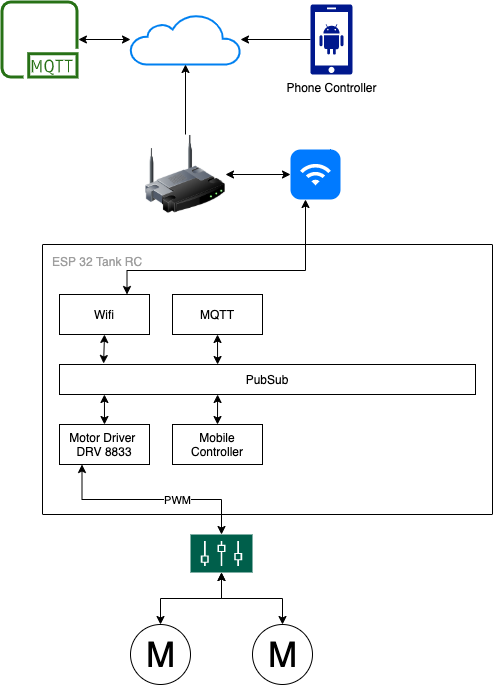
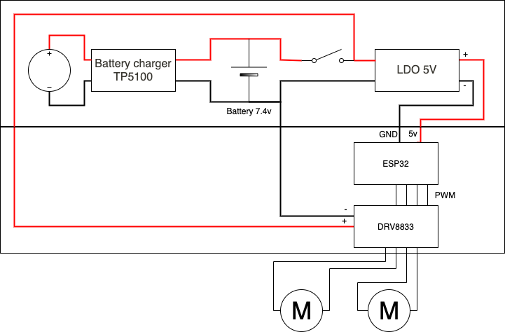
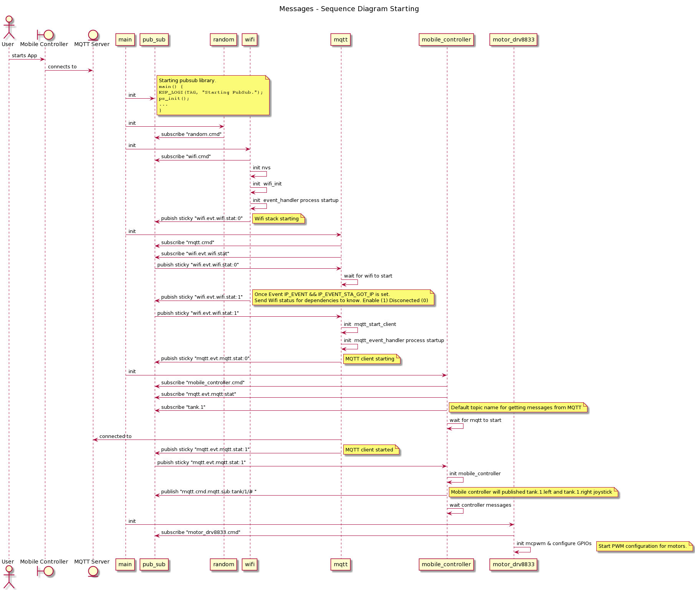
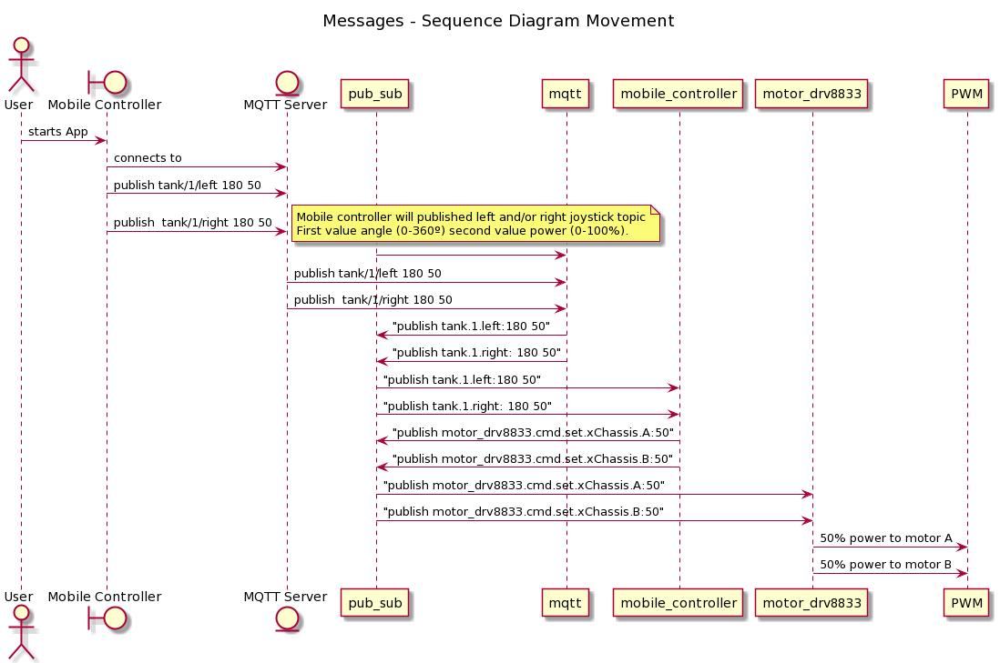
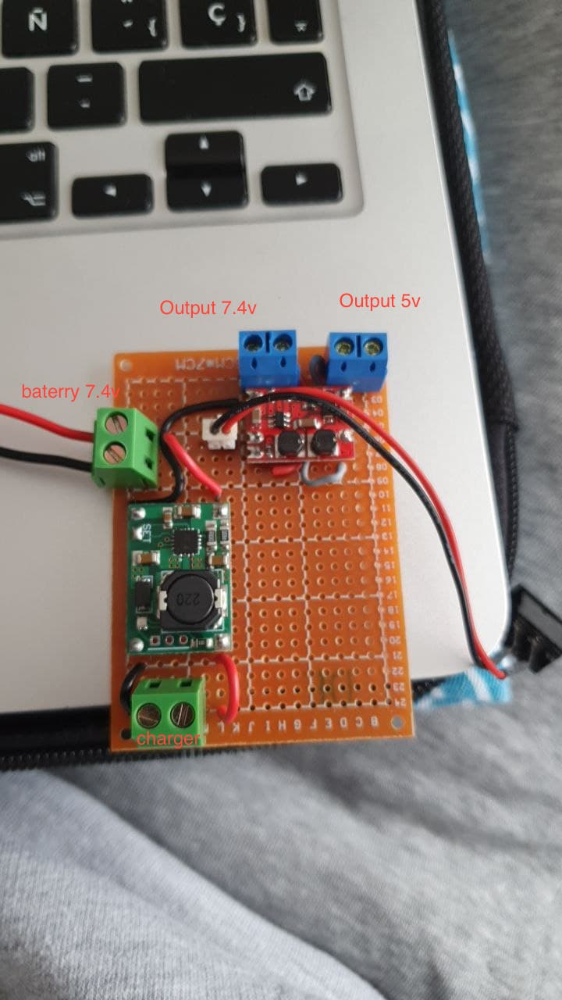
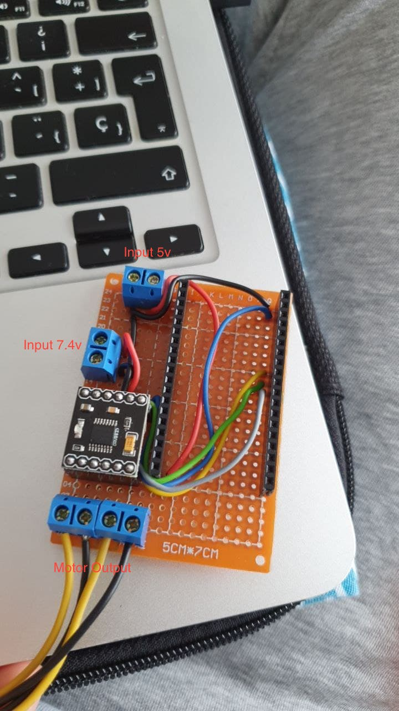
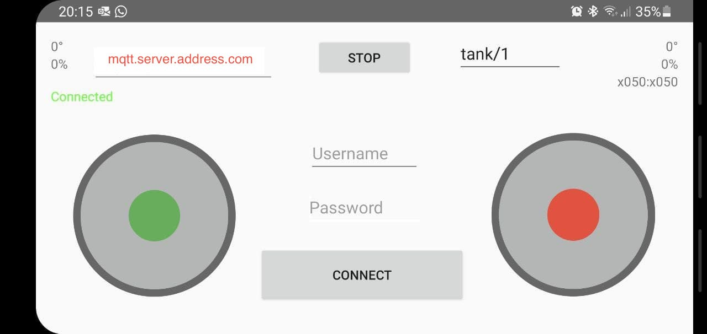
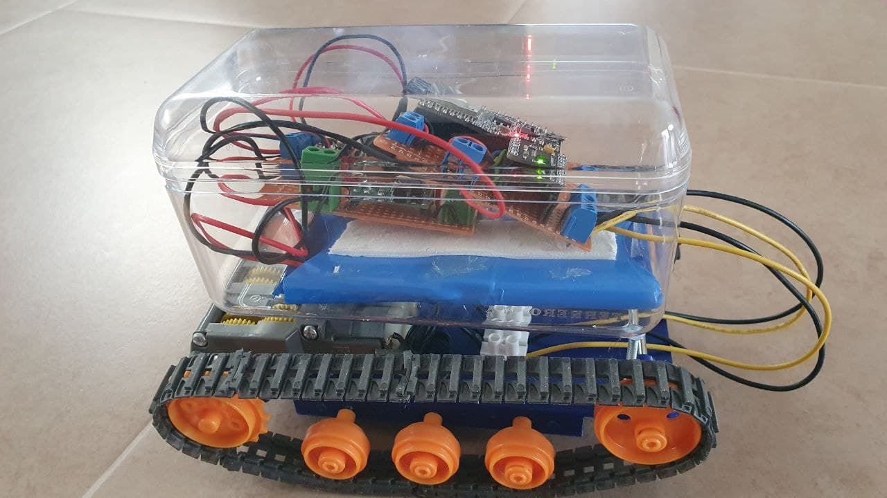
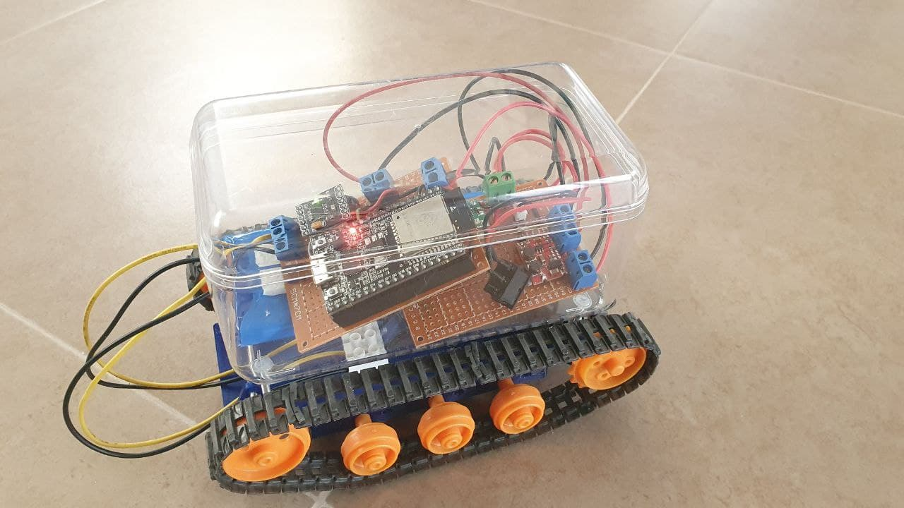

# Trunke I

Trunke is one of its kind and first of its generation.

It's a prototype rc controlled tank via MQTT and it's build using the ESP32 using ESP IDF 4.2 toolckhain. 

## How to build

To build the project `idf.py build` and to `idf.py -p PORT flash`  

Select the instructions depending on Espressif chip installed on your development board:

- [ESP32 Getting Started Guide](https://docs.espressif.com/projects/esp-idf/en/stable/get-started/index.html)
- [ESP32-S2 Getting Started Guide](https://docs.espressif.com/projects/esp-idf/en/latest/esp32s2/get-started/index.html)

## Architecture

### High level design

### Circuit Diagram

### Starting flow diagram

### Processing a message flow diagram

## Components

### Power
Power [TP5100](https://es.aliexpress.com/item/4000130857356.html?spm=a2g0s.9042311.0.0.2f0963c0jgIbUb)

### Motor driver and ESP32
Power [DRV8833](https://es.aliexpress.com/item/32752397186.html?spm=a2g0s.9042311.0.0.2f0963c0jgIbUb)

| GPIOs ESP32 | DRV8833 Input |
| ----------- | ------------- |
| 23 | IN1 |
| 19 | IN2 |
| 18 | IN3 |
| 05 | IN4 |

### Controller
[Link Google Play Store](https://play.google.com/store/apps/details?id=mqtt_controller.application)

### Build

### Demo Video

## Troubleshooting

* Program upload failure

    * Hardware connection is not correct: run `idf.py -p PORT monitor`, and reboot your board to see if there are any output logs.
    * The baud rate for downloading is too high: lower your baud rate in the `menuconfig` menu, and try again.

## Technical support and feedback

Please use the following feedback channels:

* For technical queries, go to the [esp32.com](https://esp32.com/) forum
* For a feature request or bug report, create a [GitHub issue](https://github.com/espressif/esp-idf/issues)

We will get back to you as soon as possible.

## References
* [PubSub library](https://github.com/jaracil/pubsub-c)
* [Motor Driver drv8833 inspiration](https://github.com/Roger-random/ESP32Tests/tree/4dea2aafa04f983b8d4818b09d49e5d53878b2e6/FreeRTOS_Play/src)
* [Drawio for Schemas](https://www.draw.io/)
* [PlantText for sequence diagrams](https://www.planttext.com/)
